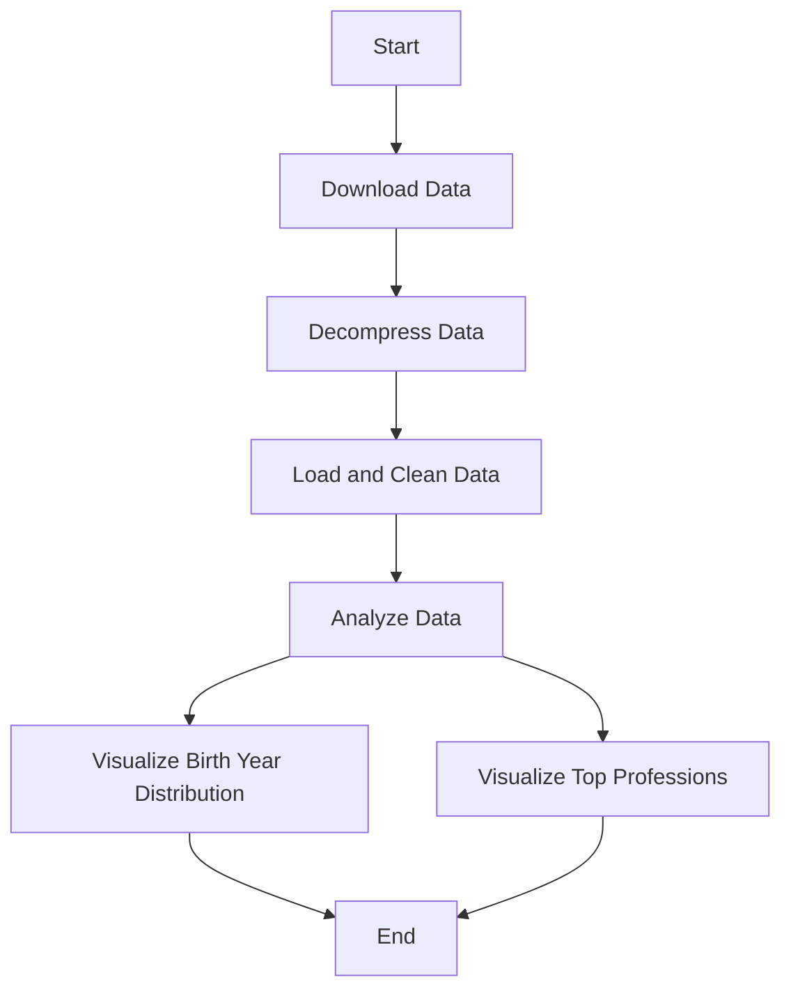

# IMDb Data Analysis Project

This project analyzes a dataset from IMDb that includes basic information about names in the film industry. The script downloads, decompresses, and processes the data to visualize the distribution of birth years and the prevalence of primary professions.

## Prerequisites

To run this script, ensure that Python is installed on your machine along with the following libraries:
- Pandas
- Matplotlib
- Seaborn
- Requests

You can install these packages using pip:

```bash
pip install pandas matplotlib seaborn requests
```

## Running the Script

To execute the script, simply run it using Python. The script will automatically download and decompress the necessary dataset from IMDb:

```bash
python imdb_analysis.py
```

## Workflow

The script follows these steps:

1. **Download Data**: Download the compressed `.gz` file from IMDb's dataset repository.
2. **Decompress Data**: Decompress the `.gz` file to extract the TSV data.
3. **Load and Clean Data**: Read the TSV file, handle data types and clean missing values.
4. **Data Analysis**: Analyze the distribution of birth years.
5. **Data Visualization**:
    - Plot the distribution of birth years.
    - Plot the frequency of the top 10 primary professions.

### Workflow Diagram



## Visualizations

The script generates two primary visualizations:

1. **Histogram of Birth Years**: Displays the distribution of birth years among the individuals in the IMDb dataset.
2. **Bar Chart of Primary Professions**: Shows the top 10 most common professions in the dataset.

## Output

The output consists of statistical analysis results and visualizations displayed as figures. Ensure your console or IDE supports graphical display, or use an IPython environment for optimal results.

## Contributing

Contributions are welcome! If you have suggestions for improving the script or additional analyses, feel free to fork this project and submit pull requests.

## License

This project is licensed under the MIT License - see the [LICENSE.md](LICENSE.md) file for details.
