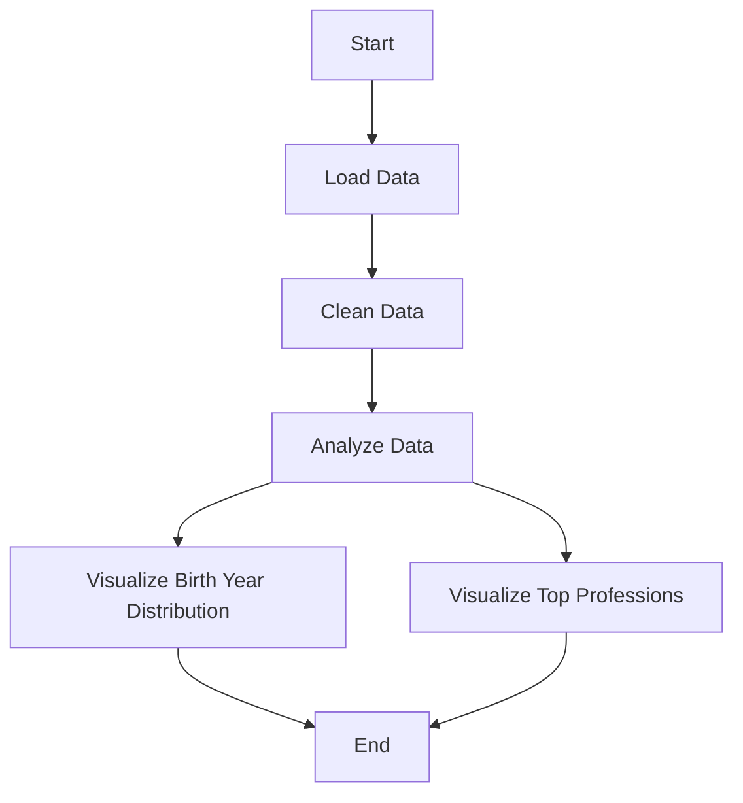

# IMDb Data Analysis Project

This project analyzes a dataset from IMDb that contains basic information about names in the film industry. The script loads the data, cleans it, and visualizes two main aspects: the distribution of birth years and the prevalence of primary professions.

## Prerequisites

To run this script, you need Python installed on your machine along with the following libraries:
- Pandas
- Matplotlib
- Seaborn

You can install these packages using pip:

```bash
pip install pandas matplotlib seaborn
```

## Running the Script

To execute the script, ensure that you have the `name.basics.tsv` file in the same directory as the script. Run the script using Python:

```bash
python imdb_analysis.py
```

## Workflow

The script follows these steps:

1. **Data Loading**: Load the `.tsv` data handling potential bad lines.
2. **Data Cleaning**: Convert `birthYear` to numeric, handle NaN values and duplicates.
3. **Data Analysis**: Calculate basic statistics for `birthYear`.
4. **Data Visualization**:
    - Plot the distribution of `birthYear`.
    - Plot the frequency of top 10 primary professions.

### Workflow Diagram



## Visualizations

The script produces two main visualizations:

1. **Histogram of Birth Years**: Shows the frequency of birth years in the dataset.
2. **Bar Chart of Primary Professions**: Displays the top 10 most common professions in the dataset.

## Output

The output consists of printed statistics and visualizations displayed as figures. Ensure that your console or IDE supports graphical display or use an IPython environment for best results.

## Contributing

Feel free to fork this project and submit pull requests with enhancements or additional analyses.

## License

This project is licensed under the MIT License - see the [LICENSE.md](LICENSE.md) file for details.
